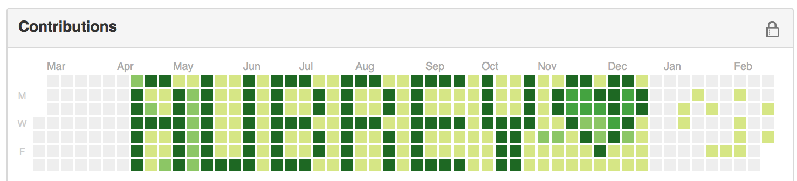

# Code For Aubrey

This project turns your github profile's public commit history into the text `AUBREY <3`.

Example:

## About Aubrey

A fellow programmer, cyclist and colleague of mine was hit while training for a charity AIDS Lifecycle ride and is in a coma.

We are showing our support for Aubrey and her family by tagging our commits and tweeting pics of us coding with the tag `#codeforaubrey`.

In addition, a campaign on [gofundme](https://www.gofundme.com/bhdrw23w) was started to help her and her family with expenses. Please help support them through this hard time [here](https://www.gofundme.com/bhdrw23w).

## How you can change your commit history to support Aubrey:

1. Clone `https://github.com/gelstudios/gitfiti`
1. Clone `https://github.com/JordanMajd/code-for-aubrey`
1. Copy the file `aubrey` from `code-for-aubrey` to `gitfiti`
1. Run `gitfiti.py` and follow the instructions.
1. I used the `gitfiti` setting when it asks if you want to go higher than current max commit level.
1. Choose an offset you like, I think I used 6.
1. When it asks to load an image type `aubrey`.
1. When it asks which images to use select `aubrey`.
1. Follow the instructions and boom!

Ideally, I could fork `gitfiti` and automate this, but time is limited. If anyone has the motivation to do this, go for it! It shouldn't be too difficult.
